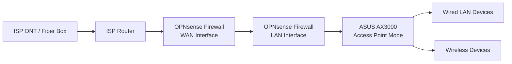

## Network Diagram (Base Topology)

```mermaid
flowchart LR
    ONT[ISP ONT / Fiber Box]
    ISP[ISP Router]
    OPNwan[OPNsense Firewall\nWAN Interface]
    OPNlan[OPNsense Firewall\nLAN Interface]
    AP[ASUS AX3000\nAccess Point Mode]
    Wired[Wired LAN Devices]
    Wireless[Wireless Devices]

    ONT --> ISP
    ISP --> OPNwan
    OPNwan --> OPNlan
    OPNlan --> AP
    AP --> Wired
    AP --> Wireless
```
